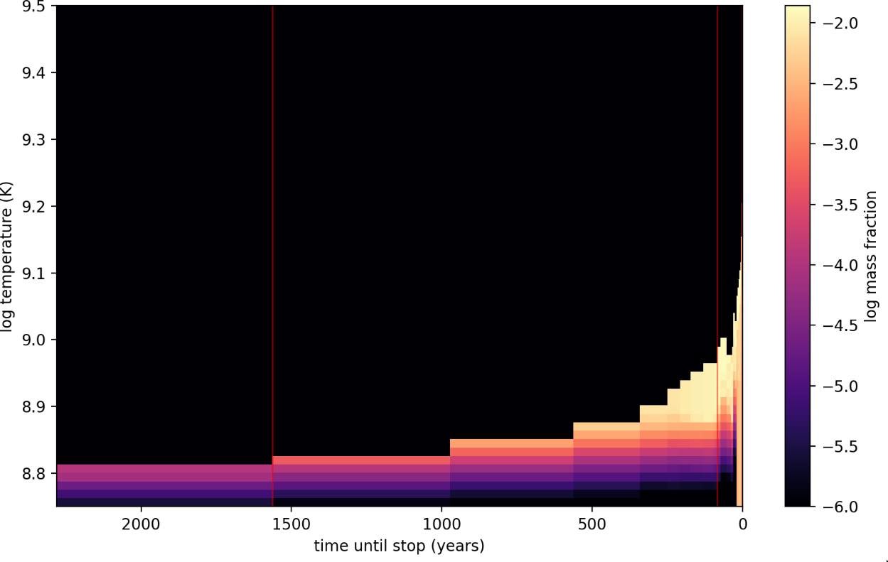
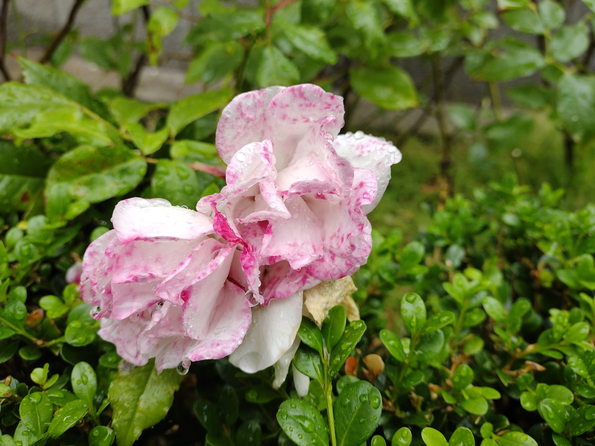

+++
modified="2024-08-16 01:53:38+00:00"
date="2024-08-29 22:00:00+00:00"
title="Undergrad Research Fair for Physics/Astronomy/EPS"
location="West Pauley Ballroom, 2495 Bancroft Way, Berkeley, CA 94720, USA"
+++

The Fall 2024 Fair will be in-person and in a new venue (West Pauley Ballroom), thanks to the co-sponsorship of MPS Scholars.  3:00p-4:00p there will be presentations by primarily Astronomy faculty, but also from students, about their research 4:00p Tabling begins by representatives from labs in Physics, Astro and EPS; Check out student poster sessions for MPS Scholars and Pi2. 6:00p Adjourn 