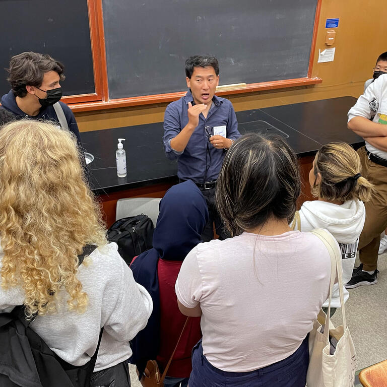

+++
modified="2024-08-16 02:01:11+00:00"
date="2024-08-27 16:30:00+00:00"
title="MPS Launch Day for incoming students"
location="unknown"
+++

Sign up: <a href="https://docs.google.com/forms/d/e/1FAIpQLSc1csarUBU2McYLHyrsRjuU20Cz1I3F0qCgbKiiGfa4C2S93Q/viewform" target="_blank">https://docs.google.com/forms/d/e/1FAIpQLSc1csarUBU2McYLHyrsRjuU20Cz1I3F0qCgbKiiGfa4C2S93Q/viewform</a>    Agenda: <b>9:30-10am</b> Registration <b>10-10:10am</b> Welcome   <b>10:10-10:40am</b> MPS Scholars, Cal Teach, and Library Info Sessions  <b>10:50am-12:00pm</b> Faculty Panel <b>12:00-1:00pm</b> Lunch with Student Groups  <b>1:00-2:00pm</b> Concurrent Sessions  <ul><li>Career Engagement: What can you do with an MPS degree?</li><li>Major Meetups: Get to know other students in your major!  </li></ul> <b>2:00-3:00pm</b> Lab Tours    *Please note, this event does not conflict with any mandatory Golden Bear Orientation (GBO) programming*